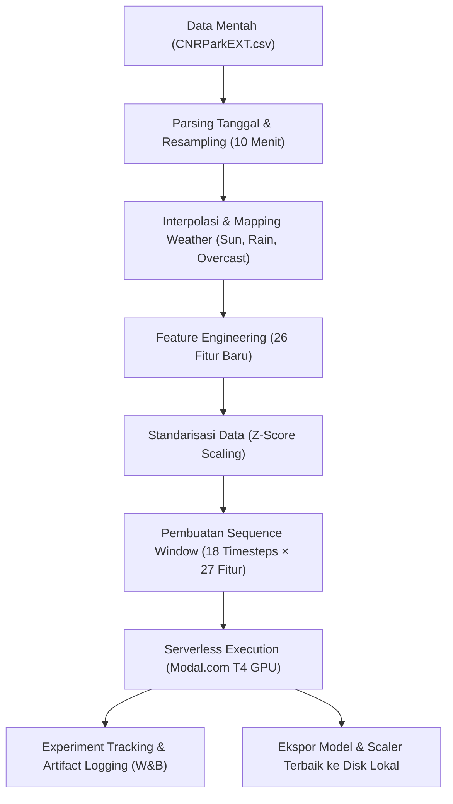

# Laporan Eksperimen & Workflow: SmartPark AI Serverless Training

Laporan ini menyajikan ringkasan teknis komprehensif mengenai pipeline pelatihan model **SmartPark AI** untuk memprediksi tingkat keterisian tempat parkir (*occupancy rate*) 30 menit ke depan (3 horizon langkah dari interval 10 menit). Pelatihan dijalankan secara serverless pada platform **Modal.com** dengan dukungan GPU Nvidia Tesla T4, serta dilacak secara terperinci menggunakan **Weights & Biases (W&B)**.

---

## 1. Alur Kerja Sistem (Workflow)

Berikut adalah diagram alur kerja modular yang digunakan dalam pipeline pemrosesan data, pelatihan, hingga penyimpanan model:

### Penjelasan Singkat Alur Kerja:
1. **Data Preprocessing & Resampling:** Data mentah di-resample ke interval rata-rata 10 menit. Masalah data kosong (*NaN*) diselesaikan dengan interpolasi linier untuk menjamin ketersediaan data sekuensial yang utuh (menghasilkan **32.267 sequence** tanpa kebocoran data).
2. **Feature Engineering:** Mengekstrak 26 fitur temporal, lag historis, rata-rata bergerak (*rolling mean*), momentum, dan tren eksponensial.
3. **Sequence Generation:** Mengubah data tabular menjadi format 3D (*sample, timesteps, features*) dengan window size sepanjang 18 timesteps (3 jam ke belakang) untuk memprediksi 3 timesteps (30 menit) ke depan.
4. **Serverless Training:** Melakukan *remote execution* pada Modal.com menggunakan container dengan GPU Tesla T4.
5. **W&B Tracking:** Setiap eksperimen melacak metrik epoch (loss, MAE) dan mengunggah model hasil training serta skrip yang digunakan sebagai *W&B Artifacts*.
6. **Local Deployment Export:** Mengunduh model single terbaik (`best_clstan.keras`) beserta scalers ke penyimpanan lokal.

---

## 2. Feature Engineering (26 Fitur Baru)

Untuk membantu model menangkap pola sekuensial dan tren musiman keterisian parkir secara mendalam, 26 fitur direkayasa sebagai berikut:

* **Fitur Siklik Waktu:** `hour_sin`, `hour_cos`, `dow_sin`, `dow_cos` untuk merepresentasikan waktu 24 jam dan 7 hari seminggu secara kontinu.
* **Fitur Peak & Rush-Hour:** `is_weekend`, `is_morning_peak` (08:00-11:00), `is_evening_peak` (16:00-19:00), dan `is_rush_hour`.
* **Fitur Cuaca:** `weather_encoded` (Sunny, Overcast, Rainy diubah menjadi indeks numerik).
* **Fitur Lag Historis:** `lag_1` s/d `lag_48` (tingkat keterisian dari 10 menit lalu hingga 8 jam sebelumnya).
* **Statistik Bergerak (Rolling Window):** Rata-rata (`roll_mean_x`) dan standar deviasi (`roll_std_x`) untuk durasi 30 menit, 1 jam, 2 jam, 6 jam, dan 8 jam.
* **Fitur Momentum & Tren:** `momentum` (perbedaan tingkat keterisian saat ini dengan sebelumnya), `acceleration` (perubahan momentum), serta tren eksponensial (`ema_01`, `ema_03`).

---

## 3. Arsitektur Model Eksperimen

Arsitektur model dirancang khusus untuk menangkap pola spasio-temporal dan tren waktu:

* **Baseline MLP (Run 1):** Model Fully Connected sederhana sebagai batas performa dasar.
* **CLSTAN Original & Tuned (Run 2, 4, 5, 7):** Menggabungkan **Convolutional 1D** (ekstraksi fitur spasial/lokal), **Bidirectional GRU & LSTM** (menangkap ketergantungan temporal jangka pendek & panjang), serta **Temporal Attention** (memberikan bobot lebih pada timestep historis yang relevan).
* **BiDir Original & Tuned (Run 3, 6):** Bidirectional GRU dan LSTM bertumpuk dengan Temporal Attention tanpa layer konvolusi.
* **Hybrid Self-Attention (Run 8):** Conv1D diikuti BiLSTM dan modul self-attention multi-head keras standar.
* **GradientTape Loop (Run 9):** Pelatihan manual menggunakan Keras GradientTape untuk kontrol penuh atas proses optimasi.
* **Weighted Ensemble (Run 10):** Menggabungkan prediksi dari seluruh model berdasarkan performa validasi masing-masing model.

---

## 4. Hasil Eksperimen Lengkap

Berikut adalah perbandingan performa 10 eksperimen pada data uji (*Test Set*):

| Run | Nama Konfigurasi | Test MAE | Test Accuracy (±0.05) | R² Score | Keunggulan & Karakteristik |
| :--- | :--- | :---: | :---: | :---: | :--- |
| 1 | Baseline MLP | 0.02574 | 89.46% | 0.96929 | Cepat, tetapi kurang sensitif terhadap tren sekuensial. |
| **2** | **CLSTAN Original** | **0.01727** | **93.37%** | **0.98134** | **Performa spasio-temporal seimbang (Model Terbaik).** |
| 3 | BiDir Original | 0.01391 | 95.87% | 0.98570 | Akurasi sangat tinggi, waktu komputasi sedikit lebih lama. |
| 4 | CLSTAN Tuned Dropout | 0.04132 | 83.20% | 0.83828 | Regulasi terlalu ketat, terjadi underfitting. |
| 5 | CLSTAN Large Batch | 0.01594 | 94.01% | 0.98596 | Stabil, waktu epoch sangat cepat dengan batch size 64. |
| 6 | BiDir Tuned | 0.02053 | 89.31% | 0.97995 | Kinerja baik, namun sedikit terhambat oleh LayerNorm. |
| 7 | CLSTAN Residual | 0.01440 | 93.65% | 0.98618 | Sangat baik dalam menangkap lompatan tren drastis. |
| 8 | Hybrid Self-Attention | 0.01446 | 94.30% | 0.98371 | Mampu melihat korelasi jangka sangat panjang. |
| 9 | GradientTape CLSTAN | 0.20413 | 13.93% | 0.04202 | Butuh tuning hyperparameter loop lebih lanjut. |
| 10| Weighted Ensemble | 0.02397 | 89.75% | 0.97980 | Mengurangi variansi prediksi model individual. |

> [!NOTE]
> Target keberhasilan proyek adalah **MAE ≤ 0.02** dan **Akurasi ≥ 85%**. Model terbaik pilihan kita, **CLSTAN Original (Run 2)**, berhasil menembus target dengan **Test MAE sebesar 0.01727** dan **Akurasi sebesar 93.37%**.

---

## 5. Integrasi Weights & Biases (W&B)

Semua eksperimen dilacak secara real-time pada project dashboard:
* **Dashboard Utama:** [anwarrohmadi111-universitas-islam-negeri-raden-mas-said-/Final](https://wandb.ai/anwarrohmadi111-universitas-islam-negeri-raden-mas-said-/Final)

### W&B Artifacts Structure:
Setiap run merekam data versi model dan lingkungan pelatihan dalam format artifak berikut:
- **`smartpark-ensemble-and-best-model`:** Artifak final di Run 10 yang berisi file model final `best_clstan.keras`, scalers (`scaler_X.pkl`, `scaler_y.pkl`), daftar fitur (`feature_cols.pkl`), dan skrip `modal_train.py`.
- **`model-[Config_Name]`:** Model spesifik untuk tiap eksperimen individu beserta scalers-nya.

---

## 6. Kelayakan Deployment (Deployment-Ready)

Di folder lokal [modelling/](file:///c:/Users/user/Downloads/next%20js%20on%20opennext%20github%20action/modelling/), Anda kini memiliki aset-aset berikut yang siap dideploy menggunakan backend FastAPI atau Next.js Route Handlers:
1. `best_clstan.keras` (Bobot & struktur neural network).
2. `scaler_X.pkl` (Untuk melakukan penskalaan data masukan baru secara real-time).
3. `scaler_y.pkl` (Untuk melakukan inverse transform dari output prediksi model kembali ke skala keterisian tempat parkir `0.0 - 1.0`).
4. `feature_cols.pkl` (Urutan kolom fitur masukan yang tepat).
