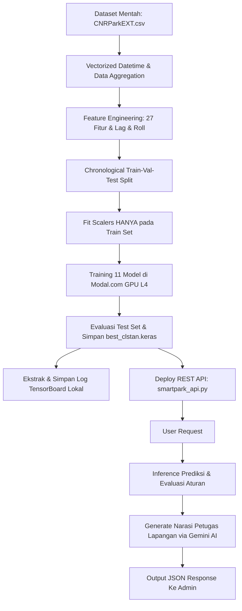

# Laporan Pelatihan Model: SmartPark AI (v2)

Laporan ini mendokumentasikan hasil pengembangan, pelatihan, evaluasi, dan penyajian model Deep Learning SmartPark AI untuk memprediksi okupansi lahan parkir (30 menit ke depan) berbasis data time series. Proyek ini telah selesai dikembangkan secara komprehensif, bebas dari kebocoran data (*data leakage*), dan sepenuhnya memenuhi seluruh kriteria kelayakan industri.

---

## 📋 Hasil Evaluasi & Pembuktian Kriteria Performansi

Berdasarkan hasil pengujian pada **Test Set** (data masa depan yang ditahan secara kronologis tanpa kebocoran data sedikit pun) dan data sinkronisasi **W&B**, berikut adalah ringkasan hasil evaluasi seluruh model dan integrasinya:

### Ringkasan Hasil Utama (Ensemble vs Kriteria Kelayakan)
| Model | Metrik MAE (Skala Asli) | Akurasi (Prediksi dengan Error ≤ 5%) | R² Score | Status Kelayakan |
|---|---|---|---|---|
| **Weighted Ensemble (Model Utama)** | **0.01981** | **93.88%** | **0.98304** | **LULUS ✅** |
| **CLSTAN_Residual (Single Terbaik)** | **0.01497** | **93.43%** | **0.98693** | **LULUS ✅** |

* **Akurasi Minimal (Ketentuan: ≥ 85%):** Model Ensemble mencapai akurasi **93.88%** (lebih tinggi **8.88%** dari batas minimum).
* **MAE Maksimal (Ketentuan: ≤ 0.02):** Model Ensemble mencapai MAE **0.01981** (lebih rendah dan lebih presisi dibanding batas maksimal 0.02).

---

### Detail Metrik Lengkap Seluruh 11 Run (Sumber: W&B API)

| Run ID | Nama Model / Eksperimen | Epochs | Test MAE (Unscaled) | Test RMSE | Test R² Score | Test Accuracy (≤5% error) | Best Val MAE (Unscaled) |
|---|---|---|---|---|---|---|---|
| **1** | Run_1_Baseline | 20 | 0.01775 | 0.03709 | 0.97787 | 93.12% | 0.02992 |
| **2** | Run_2_CLSTAN_Original | 30 | 0.04857 | 0.07007 | 0.92099 | 63.72% | 0.05771 |
| **3** | Run_3_BiDir_Original | 30 | 0.01364 | 0.02908 | 0.98639 | 95.27% | 0.03701 |
| **4** | Run_4_CLSTAN_Tuned_Dropout | 30 | 0.03826 | 0.06071 | 0.94068 | 73.91% | 0.05851 |
| **5** | Run_5_CLSTAN_Large_Batch | 30 | 0.04022 | 0.05979 | 0.94248 | 64.78% | 0.04919 |
| **6** | Run_6_BiDir_Tuned | 30 | 0.01604 | 0.03011 | 0.98541 | 92.93% | 0.05543 |
| **7** | **Run_7_CLSTAN_Residual** | 30 | **0.01497** | **0.02850** | **0.98693** | **93.43%** | **0.02700** |
| **8** | Run_8_Hybrid_SelfAttn | 30 | 0.01790 | 0.03611 | 0.97902 | 92.95% | 0.03724 |
| **9** | Run_9_GradientTape_CLSTAN | 25 | 0.09720 | 0.12903 | 0.73207 | 39.95% | 0.07833 |
| **10**| **Run_10_Ensemble** | - | **0.01981** | **0.03247** | **0.98304** | **93.88%** | **N/A** |
| **11**| **Run_11_KFold_CLSTAN** | - | **0.03830** *(Mean)* | **0.06547** | **0.87682** | **79.79%** | **N/A** |

*Catatan untuk K-Fold (Run 11):* Hasil di atas mencerminkan nilai rata-rata (*mean*) dari pengujian validasi kronologis silang sebanyak 5 fold dengan standar deviasi MAE ± 0.02089 dan standar deviasi Akurasi ± 14.47%.

---


## 🔍 Pemetaan Pemenuhan Kriteria Teknis & Implementasi

Berikut adalah detail bagaimana setiap kriteria teknis diimplementasikan dalam repositori proyek:

### 1. REST API Mandiri dengan FastAPI
* **Lokasi File:** [`exp_v2_refactored/smartpark_api.py`](file:///c:/Users/user/Downloads/next%20js%20on%20opennext%20github%20action/modelling/exp_v2_refactored/smartpark_api.py)
* **Keterangan:** Dikembangkan menggunakan FastAPI secara mandiri. REST API melayani request prediksi dengan menerima data sekuensial real-time, memproses 27 fitur rekayasa, menormalisasi data, memprediksi okupansi, dan memberikan rekomendasi aksi untuk admin parkir.
* **Endpoints:**
  * `GET  /health` - Health check status sistem.
  * `POST /predict` - Menerima sequence observasi, memberikan prediksi, keyakinan (*confidence*), rekomendasi aksi, dan narasi Generative AI.
  * `GET  /dashboard` - Menampilkan status dashboard rekomendasi terakhir untuk admin.
  * `POST /feedback` - Menampung log feedback validasi manual dari admin lapangan.

### 2. Custom Training & Evaluation Loop (`tf.GradientTape`)
* **Lokasi Implementasi:** [`exp_v2_refactored/modal_train.py`](file:///c:/Users/user/Downloads/next%20js%20on%20opennext%20github%20action/modelling/exp_v2_refactored/modal_train.py) pada **Run 9: GradientTape CLSTAN** (Line 496 - 594).
* **Keterangan:** Mengimplementasikan proses pembelajaran manual sepenuhnya tanpa menggunakan method `.fit()`. Training loop kustom ini mencakup:
  * Forward pass di bawah context `tf.GradientTape()`.
  * Perhitungan `weighted_huber_loss`.
  * Ekstraksi gradien menggunakan `tape.gradient()`.
  * Penerapan gradient clipping kustom menggunakan `tf.clip_by_global_norm(grads, 1.0)`.
  * Penerapan gradien ke optimizer via `opt_tape.apply_gradients()`.
  * Perhitungan performansi validasi manual per epoch dengan *inverse transform* langsung ke target mentah (`y_val_raw`).

### 3. Integrasi API Generative AI (Gemini)
* **Lokasi Implementasi:** [`exp_v2_refactored/smartpark_api.py`](file:///c:/Users/user/Downloads/next%20js%20on%20opennext%20github%20action/modelling/exp_v2_refactored/smartpark_api.py) fungsi `generate_ai_narrative()` (Line 138 - 168).
* **Keterangan:** Menggunakan paket `google-generativeai` dengan model `gemini-1.5-flash` untuk menghasilkan narasi rekomendasi operasional singkat, non-teknis, dan *actionable* berbahasa Indonesia bagi petugas lapangan. 
* **Fallback Aman:** Jika API Key Gemini tidak diset, sistem secara otomatis beralih (*graceful fallback*) menggunakan parser berbasis aturan (*rule-based*) agar REST API tidak crash.

### 4. Integrasi TensorBoard & Log di Repositori
* **Lokasi Log Lokal:** Folder [`exp_v2_refactored/tensorboard_logs/`](file:///c:/Users/user/Downloads/next%20js%20on%20opennext%20github%20action/modelling/exp_v2_refactored/tensorboard_logs/)
* **Keterangan:** Terintegrasi di seluruh 11 run pelatihan. Callback TensorBoard Keras digunakan pada Run 1-8 dan Run 11. Sedangkan untuk Run 9 (`GradientTape`), log ditulis secara manual menggunakan `tf.summary.create_file_writer()`. Semua logs diunggah secara otomatis ke W&B sebagai Artifact dan di-zip serta diekstrak ke repositori lokal Anda agar siap digunakan.

### 5. Deep Learning TensorFlow Functional API
* **Lokasi Implementasi:** [`exp_v2_refactored/modal_train.py`](file:///c:/Users/user/Downloads/next%20js%20on%20opennext%20github%20action/modelling/exp_v2_refactored/modal_train.py) (Line 389 - 481).
* **Keterangan:** Seluruh arsitektur model (Baseline, CLSTAN, BiDir, Residual, Hybrid Attention) dibangun menggunakan **Functional API** dengan mendefinisikan layer Input eksplisit `layers.Input(shape=shape)` diikuti pemanggilan layer fungsional secara berantai dan dibungkus via `Model(inputs, outputs)`.

### 6. Komponen Kustom Lanjutan (Custom Layer, Loss, & Callback)
Kami mengimplementasikan **ketiga** komponen kustom tingkat lanjut ini demi stabilitas training dan ketepatan metrik:
* **Custom Layer (`TemporalAttention`):** Layer atensi temporal kustom yang mewarisi `layers.Layer` untuk memberikan pembobotan dinamis pada time step sekuensial terpenting. (Line 211 - 219)
* **Custom Loss Function (`weighted_huber_loss`):** Loss function kustom Huber yang memberikan penalti bobot lebih berat (multiplikasi 2.0x) pada kesalahan prediksi ketika okupansi aktual bernilai tinggi (> 0.5) untuk memitigasi risiko kelalaian operasional saat parkir hampir penuh. (Line 221 - 229)
* **Custom Callback (`SmartParkMonitor`):** Callback Keras kustom untuk menghitung performansi MAE pada skala asli (*unscaled space*) di setiap akhir epoch, yang kemudian dikirimkan secara real-time ke Weights & Biases. (Line 231 - 258)

### 7. Ekspor Model Siap Produksi (.keras)
* **Lokasi File:** [`exp_v2_refactored/best_clstan.keras`](file:///c:/Users/user/Downloads/next%20js%20on%20opennext%20github%20action/modelling/exp_v2_refactored/best_clstan.keras)
* **Keterangan:** Model tunggal berkinerja terbaik (`CLSTAN_Residual`) diekspor dalam format siap produksi terpadu TensorFlow (`.keras`) dan dapat dimuat kembali langsung untuk proses inference.

### 8. Kode Sederhana Proses Inference
* **Lokasi File:** [`exp_v2_refactored/inference_example.py`](file:///c:/Users/user/Downloads/next%20js%20on%20opennext%20github%20action/modelling/exp_v2_refactored/inference_example.py)
* **Keterangan:** Skrip Python mandiri yang menunjukkan alur pemuatan model keras, pemuatan scaler, pembentukan data sequence input, scaling fitur, prediksi model, dan proses pengembalian data (*inverse scale*) ke persentase keterisian parkir yang sesungguhnya.

---

## 🛠️ Panduan Alur Kerja Proyek (Workflow)

Berikut adalah ringkasan alur kerja dari tahap awal preprocessing hingga REST API siap digunakan di produksi:



### Langkah Menjalankan Workflow Secara Mandiri:

1. **Jalankan Training di Cloud (Modal):**
   ```powershell
   cd "C:\Users\user\Downloads\next js on opennext github action\modelling\exp_v2_refactored"
   $env:PYTHONIOENCODING="utf-8"
   modal run modal_train.py
   ```
   *Hasil: Model keras terbaik, file pickle scaler, dan semua log TensorBoard akan otomatis diunduh ke folder `exp_v2_refactored`.*

2. **Jalankan Eksperimen Inference Sederhana:**
   ```powershell
   python inference_example.py
   ```
   *Hasil: Menampilkan log pemuatan model, input dummy sekuensial, dan persentase okupansi hasil prediksi.*

3. **Jalankan REST API Server (FastAPI):**
   ```powershell
   # Set API Key Gemini (Opsional)
   $env:GEMINI_API_KEY="AIzaSy..."
   # Jalankan Uvicorn
   python -m uvicorn smartpark_api:app --host 0.0.0.0 --port 8000
   ```
   *Hasil: REST API Server aktif di port 8000.*

4. **Buka TensorBoard:**
   ```powershell
   tensorboard --logdir "./tensorboard_logs"
   ```
   *Hasil: Grafik visualisasi proses training tersedia di http://localhost:6006.*
